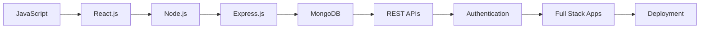

<div align="center">


<br>

<a href="https://git.io/typing-svg">

</a>

<br><br>


<a href="https://github.com/Khalid0858?tab=followers">

</a>

<a href="https://github.com/Khalid0858">

</a>

</div>

<br>

## 👨‍💻 About Me

const khalid = {
    name: "Khalid Hasan",
    role: "MERN Stack Developer",
    education: "Computer Science & Engineering",
    
   technologies: {
        frontend: ["HTML", "CSS", "JavaScript", "React.js"],
        backend: ["Node.js", "Express.js"],
        database: ["MongoDB"],
        tools: ["Git", "GitHub", "VS Code"]
    },
    currentlyLearning: [
        "Advanced React.js",
        "REST API Development",
        "Authentication & Authorization",
        "Full-Stack Architecture"
    ],

currentFocus: "Building real-world full-stack applications",

 goal: "Become a professional Full-Stack Software Developer"
};


<br>

<table>
<tr>
<td width="50%" valign="top">

### 🚀 What I'm Doing

* 🔭 Building **web & full-stack projects**
* 🌱 Improving my **MERN Stack skills**
* ⚛️ Learning advanced **React.js**
* 🟢 Working with **Node.js & Express.js**
* 🍃 Learning better **MongoDB database design**
* 🔗 Building and understanding **REST APIs**

</td>

<td width="50%" valign="top">

### 🎯 What I'm Interested In

* 💻 Full-Stack Web Development
* ⚙️ Backend Development
* 🗄️ Database Design
* 🔐 Authentication & Security
* 🤖 Artificial Intelligence / ML
* 🛡️ Cybersecurity
* 🧠 Problem Solving & DSA

</td>
</tr>
</table>

<br>

<!-- ===================== TECH STACK ===================== -->

## 🛠️ Tech Stack

<div align="center">

### Frontend


<br><br>

### Backend & Database


<br><br>

### Tools & Development


</div>

<br>

<!-- ===================== MERN ===================== -->

## ⚡ My MERN Development Stack

<div align="center">

<table>
<tr>

<td align="center" width="25%">

<br><br>
<b>MongoDB</b>
<br>
<sub>Database</sub>
</td>

<td align="center" width="25%">

<br><br>
<b>Express.js</b>
<br>
<sub>Backend Framework</sub>
</td>

<td align="center" width="25%">

<br><br>
<b>React.js</b>
<br>
<sub>Frontend Library</sub>
</td>

<td align="center" width="25%">

<br><br>
<b>Node.js</b>
<br>
<sub>JavaScript Runtime</sub>
</td>

</tr>
</table>

### `MongoDB  →  Express.js  →  React.js  →  Node.js`

</div>

<br>

<!-- ===================== FOCUS ===================== -->

## 🔥 Current Development Focus

<div align="center">


<br><br>


</div>

<br>

<!-- ===================== PROJECTS ===================== -->

## 🚀 Featured Projects

<table>

<tr>

<td width="50%" valign="top">

### 🛒 Green Market

A web-based shopping project developed while practicing JavaScript-driven user interactions and e-commerce functionality.

**Features**

`Shopping Cart` `Price Calculation`
`Receipt Flow` `Review System`
`Login UI` `Product Interaction`

**Tech Stack**


**Status:** 🚧 `Work in Progress`

<br>

[](https://github.com/Khalid0858/green)

</td>

<td width="50%" valign="top">

### 👨‍💻 Portfolio Practice

An early web development project created while learning how personal portfolio websites are structured and developed.

**Focus**

`Web Structure` `Frontend Basics`
`Portfolio Design` `HTML Practice`

**Tech Stack**


**Status:** 🔨 `In Development`

<br>

[](https://github.com/Khalid0858/my-new-repo)

</td>

</tr>

<tr>

<td width="50%" valign="top">

### 🎨 Practice of CSS

A learning-focused project where I practice CSS styling, layouts, frontend structure, and visual presentation.

**Focus**

`CSS Styling` `Layouts`
`Frontend Design` `Web Fundamentals`

**Tech Stack**


**Status:** 📚 `Learning Project`

<br>

[](https://github.com/Khalid0858/Practice-Of-CSS)

</td>

<td width="50%" valign="top">

### 📋 List & Form Web

A frontend practice project focused on learning HTML forms, lists, webpage structure, and basic interface elements.

**Focus**

`HTML Forms` `Lists`
`Page Structure` `Web Fundamentals`

**Tech Stack**


**Status:** 📚 `Learning Project`

<br>

[](https://github.com/Khalid0858/My-List-Form-web)

</td>

</tr>

</table>

<br>

<!-- ===================== CURRENTLY BUILDING ===================== -->

## 🚧 Currently Building

```text
┌──────────────────────────────────────────────────────────────┐
│                                                              │
│   My current journey is focused on moving from frontend      │
│   practice projects toward complete MERN applications.       │
│                                                              │
│   ⚛  React Frontend                                          │
│   🟢 Node.js Backend                                         │
│   🚂 Express.js REST APIs                                    │
│   🍃 MongoDB Database                                        │
│   🔐 Authentication & Authorization                          │
│   🚀 Deployment                                              │
│                                                              │
└──────────────────────────────────────────────────────────────┘
```

> New full-stack projects will be added as I continue building and improving my development skills.

<br>

<!-- ===================== LEARNING ===================== -->

## 🌱 Learning Roadmap



### Currently Exploring

* ⚛️ Advanced React.js
* 🟢 Node.js backend development
* 🚂 Express.js architecture
* 🍃 MongoDB & database design
* 🔗 REST API development
* 🔐 Authentication & Authorization
* 🧩 Full-stack application architecture
* 🧠 Data Structures & Algorithms
* 🤖 AI / Machine Learning
* 🛡️ Cybersecurity

<br>

<!-- ===================== GITHUB STATS ===================== -->

## 📊 GitHub Analytics

<div align="center">


<br>


</div>

<br>

<!-- ===================== ACTIVITY ===================== -->

## 📈 GitHub Activity

<div align="center">


</div>

<br>

<!-- ===================== GOALS ===================== -->

## 🎯 Goals

<table>
<tr>
<td>

💻 Build production-quality full-stack applications

</td>
<td>

⚙️ Strengthen backend development skills

</td>
</tr>

<tr>
<td>

🧠 Improve DSA & problem-solving

</td>
<td>

🏗️ Learn scalable software architecture

</td>
</tr>

<tr>
<td>

🌍 Contribute to open-source projects

</td>
<td>

🚀 Prepare for software engineering opportunities

</td>
</tr>
</table>

<br>

<!-- ===================== CONNECT ===================== -->

## 🤝 Connect With Me

<div align="center">

<a href="https://github.com/Khalid0858">

</a>

<a href="YOUR_LINKEDIN_URL">

</a>

<a href="mailto:YOUR_EMAIL_ADDRESS">

</a>

<a href="YOUR_PORTFOLIO_URL">

</a>

</div>

<br>

<!-- ===================== QUOTE ===================== -->

<div align="center">

### 💻 Code. Learn. Build. Improve. Repeat.

<sub>
Every project is another step toward becoming a better developer.
</sub>

<br><br>

⭐ **Feel free to explore my repositories and follow my development journey.**

</div>

<!-- ===================== FOOTER ===================== -->


